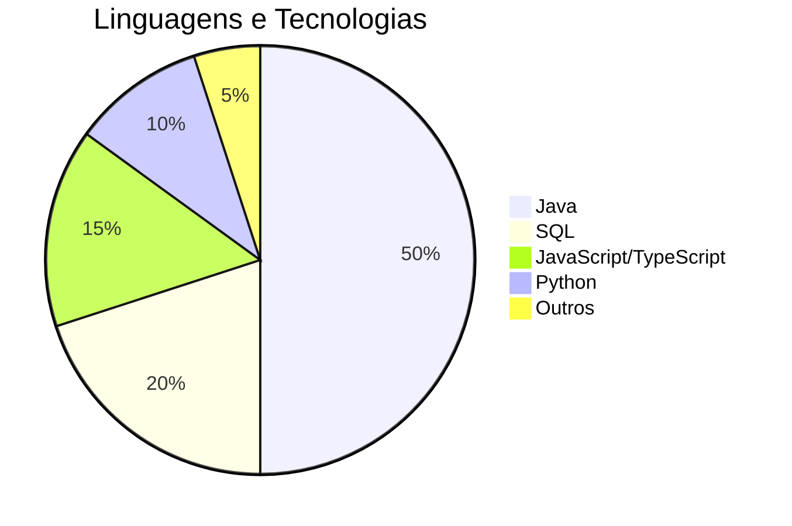

# 👨‍💻 João Victor Michaeli de Bem  

📍 **São Paulo, Brasil**  
📧 [E-mail](mailto:joaovictor_de_bem_@hotmail.com) | [LinkedIn](https://www.linkedin.com/in/joaomichaeli/)  

---

## 📌 Sobre Mim  

Sou um **desenvolvedor Java** em formação, apaixonado por criar soluções robustas e escaláveis. Tenho experiência prática no desenvolvimento de **APIs REST, sistemas web e integração com bancos de dados**, aplicando boas práticas de programação e arquitetura de software.  
Possuo sólida base em **Java, Spring Boot, JPA e SQL**, além de conhecimentos complementares em front-end para aplicações FullStack.  

---

## 📊 Habilidades Técnicas  

### 💻 **Linguagens & Frameworks**
- **Java (Spring Boot, JPA, APIs REST)**
- SQL (Oracle, PostgreSQL)  
- JavaScript / TypeScript (React, Next.js)  
- Python (projetos complementares)

### 🛠 **Ferramentas & Tecnologias**
- Git & GitHub  
- Docker  
- Postman  
- Data Modeler  

---

## 🎓 Formação Acadêmica  
- **Tecnologia em Análise e Desenvolvimento de Sistemas** – FIAP *(Conclusão em 2025)*  

---

## 💼 Objetivo Profissional  
Ingressar como **Desenvolvedor Java Backend** e aplicar meus conhecimentos em projetos desafiadores, contribuindo para a evolução tecnológica da empresa.  

---

## 📫 Entre em Contato  
💼 [LinkedIn](https://www.linkedin.com/in/joaomichaeli/)  
📧 [E-mail](mailto:joaovictor_de_bem_@hotmail.com)  

---

> 🚀 *"Com Java, construindo soluções que movem o mundo!"*
